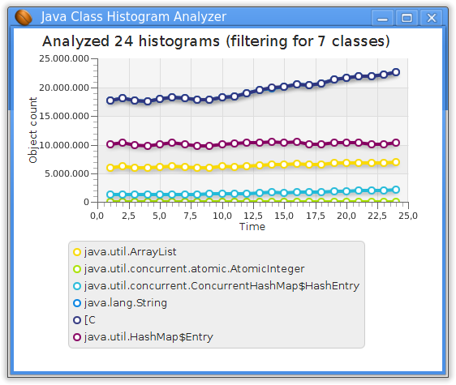

# jcha - Java Class Histogram Analyser

jcha is a tool to analyse Java class histograms, focused on histogram comparison.
It can aid in debugging memory leaks, or for finding memory dominators before issues arise.
jcha reads histograms written by "jcmd pid GC.class_histogram". It is best to
capture multiple histograms, so this package also contains jcha-capture, a script for
time-based histogram capturing.

Two or more histograms can be compared, to find classes that change a lot in number of instances
or size. You can either use the command line tool jcha  or the JavaFX GUI application jcha-gui.
Both tools support class filtering, by either giving a limit or a class list.




## Building
Build requires Maven and Java 8 (or Java 7, see below). All other dependencies are pulled in by Maven.
```
  mvn package assembly:single
```

### Building with Oracle JDK 7
Requires adding JavaFX to pom.xml. For this you need to uncomment the corresponding
section containing the jfxrt dependency. See http://zenjava.com/javafx/maven/fix-classpath.html
why this workaround is necessary.

### Building and running with OpenJDK7
OpenJDK7 does not always ship with JavaFX included. Not recommended, use OpenJDK8 instead. If you
really must, then the minimum is to copy a jfxrt.jar to JDK_HOME/jre/lib/ext/ .

## Running
You can run jcha directly from the build directory. It requires Java 7 or above.
jcha-gui requires JavaFX to be in the classpath. All Java 8 and some Java 7 installations fulfill this dependency.
```
 jcha-capture 100 10 pid filnamePrefix               # Capture 100 histograms, delay between is 10 seconds
 jcmd pid GC.class_histogram > classhistogram01.jch  # Capture a single histogram, directly with jcmd from JDK

 jcha classhistogram01.jch classhistogram02.jch      # Start jcha with 2 *.jch files in the directory
 jcha -h                                             # for showing help on all options like sorting
 
 jcha-gui *.jch                                      # Start GUI with all *.jch files in the directory
```

Shortcut, using a shell alias:
```
 path=`pwd`
 alias jcha=$path/jcha
 alias jcha-gui=$path/jcha-gui
```

## Enhancements done since initial version
 * V1.1
 ** Correlate class statistics to find common characteristics like "growing about the same amount"
 ** Auto-selector, that finds most interesting classes for jcha-gui (a graph with 100 classes does not make much sense)
 * V1.2beta
 ** Live view from running JVM by reading MBean via JMX.
     jcha --jmx host:port -U interval   

## Possible future enhancements
 * Selecting classes (-C option): Implement pattern-match and also allow path-based class names like java/lang/String
 * Using the classpath of the analysed application, find the culprit class causing a leak.
 * Optionally use timestamps instead of numbers as x-Axis. Either from file inode (-t [ctime|utime|atime|time])
   or filename pattern (-t name regexp)

## Known bugs
 * Class name caption is missing in jcha-gui when showing 10 classes or more. 

## License
Apache License 2.0

Copyright 2014-present trivago GmbH

